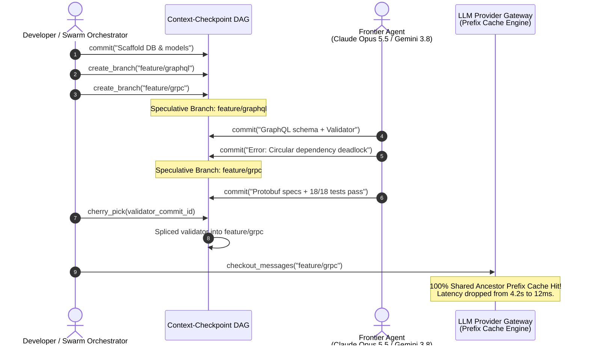
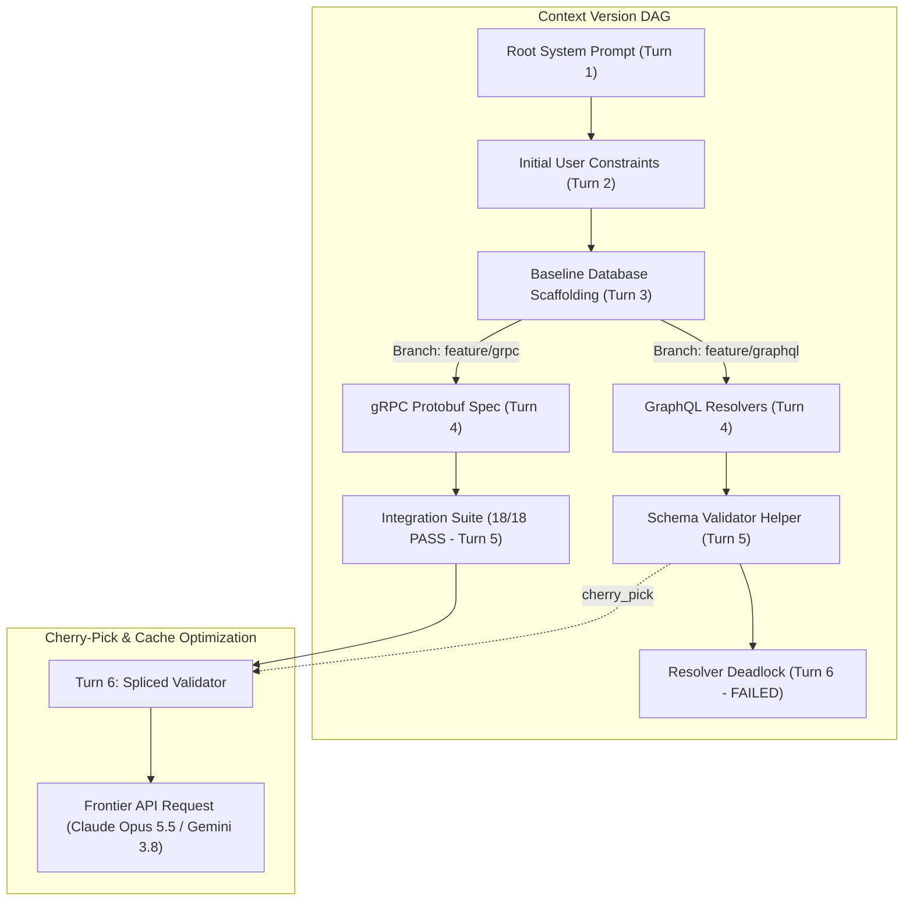
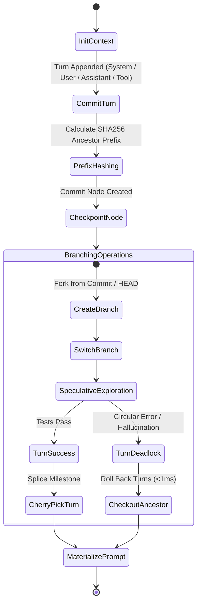

# 🌲 Context-Checkpoint

> **Git-Style Deterministic Branching, Delta Caching & Time-Travel State for Long-Horizon Agent Contexts**  
> Brings version control primitives to 1M+ token context windows in frontier agents (**Claude Opus 5.5**, **Gemini 3.8 Flash**, **GPT-6 Astra**). Fork exploration branches, time-travel to prior turns in `<1ms`, cherry-pick milestones across trajectories, and preserve 100% prefix prompt cache hits.

[](https://opensource.org/licenses/MIT)
[](https://www.python.org/downloads/)
[](https://github.com/AAH20/context-checkpoint)
[](https://anthropic.com)

---

## ⚡ The Problem: The Long-Horizon Context Deadlock

As frontier models (**Claude Opus 5.5**, **Gemini 3.8 Flash**, **GPT-6 Astra**) execute complex multi-hour programming tasks spanning 50+ turns, agents frequently run into dead ends (e.g. an incompatible ORM, a circular dependency, or an unrecoverable hallucination):
1. **The Context Reset Penalty**: Wiping the conversation purges all initial project architecture, rules, and discovered schemas, forcing the model to re-ingest hundreds of thousands of tokens from scratch (incurring multi-second TTFT latency and massive API bills).
2. **Context Contamination**: Leaving failed reasoning attempts and broken tool outputs in context causes "cognitive inertia", biasing future decisions toward previous mistakes.
3. **No Speculative Exploration**: Agents cannot explore two competing implementation ideas (e.g. gRPC vs GraphQL) in parallel without spinning up completely separate, disconnected sessions.

**Context-Checkpoint** introduces Git-like DAG version control for conversational agent states. You can commit turns, branch speculative paths, roll back in `<1ms`, and cherry-pick successful code generators across branches without ever invalidating upstream KV prompt caches.

---

## 🏛️ Architecture & Context DAG







---

## 🚀 Key Features

- **Git-Style Context Control**: `commit()`, `create_branch()`, `switch_branch()`, `checkout_messages()`, and `cherry_pick()` for agent conversations.
- **100% Prefix Cache Preservation**: Generates deterministic lineage hashes, guaranteeing that branching and time-travel reuse provider KV prompt caches (Anthropic Prompt Caching & Google Gemini Context Caching).
- **Sub-Millisecond Time Travel**: Roll back 10 turns or switch branches in `<0.01ms` without filesystem I/O.
- **Multi-Branch Diffing**: Compute divergence points and token counts between speculative branches via `diff_branches()`.
- **Zero-Dep Python 3.10+**: Lightweight, typed, and compatible with any LLM harness.

---

## 📦 Quick Start

### Installation

```bash
pip install context-checkpoint
```

### Python SDK Usage

```python
from context_checkpoint import ContextTree, TurnRole

# 1. Initialize root context tree
tree = ContextTree(initial_system_prompt="You are a senior systems architect.")

# 2. Record turns
c1 = tree.commit(TurnRole.USER, "Design high-throughput payment engine", "user prompt")
c2 = tree.commit(TurnRole.ASSISTANT, "Created PostgreSQL ledger schema", "architecture")

# 3. Fork speculative exploration branches
tree.create_branch("feature/grpc", from_ref=c2.commit_id)
tree.switch_branch("feature/grpc")

tree.commit(TurnRole.ASSISTANT, "Implemented streaming gRPC RPCs", "grpc logic")
tree.commit(TurnRole.TOOL, "Tests Passed: 18/18 passed", "test oracle", tool_name="pytest")

# 4. Materialize linear message list for LLM call
messages = tree.checkout_messages()
# Output: [{'role': 'system', ...}, {'role': 'user', ...}, {'role': 'assistant', ...}, ...]
```

---

## 💻 CLI Interactive Demonstration

Run the built-in interactive demo to explore context branching, dead-end isolation, and cross-branch cherry-picking:

```bash
context-checkpoint demo
```

```
==========================================================================
  CONTEXT-CHECKPOINT: Git-Style Context Version Control for Frontier AI
  Optimized for Long-Horizon Reasoning in Claude Opus 5.5 & Gemini 3.8 Flash
==========================================================================

[STEP 1] BASELINE LINEAGE COMMITTED (main branch)
  Head Commit: 155c9fe16a (feat(arch): database schema and sequence lock scaffolding)
  Cumulative Tokens: 60 | Prefix Hash: c5a94dd2352b

[STEP 2] FORKING SPECULATIVE EXPLORATION BRANCHES
  Created branch 'feature/graphql' at common ancestor commit 155c9fe16a
  Created branch 'feature/grpc' at common ancestor commit 155c9fe16a
  [Branch: feature/graphql] Reached turn 6 (Encountered circular dependency deadlock)
  [Branch: feature/grpc] Reached turn 5 (All 18 tests passed cleanly)

[STEP 3] BRANCH DIVERGENCE ANALYSIS
  Common Ancestor: 155c9fe16a
  GraphQL Divergent Commits: 3 (58 tokens)
  gRPC Divergent Commits   : 2 (33 tokens)

[STEP 4] CHERRY-PICKING COMPONENT INTO WINNING BRANCH
  Cherry-picking validator commit 21a35d5bea from feature/graphql into feature/grpc...
  >> Cherry-picked to 98bb76313a: cherry-pick(21a35d5bea): feat(util): robust ledger amount validator helper
  >> Tokens Saved via Delta Reuse: 20 tokens

[STEP 5] MATERIALIZED MESSAGES FOR FRONTIER MODEL INGESTION (6 turns)
  [1] (system) You are an autonomous engineering agent specializing in dist...
  [2] (user) Build a high-throughput transaction ledger with idempotent r...
  [3] (assistant) Scaffolded PostgreSQL schema with transaction logs, sequence...
  [4] (assistant) Implemented Protobuf protocol specs with gRPC streaming RPCs...
  [5] (tool) Tests Passed: 18/18 gRPC integration tests passed with 0.12m...
  [6] (assistant) def validate_amount(val): return val > 0 and val < 1_000_000...

==========================================================================
  CONTEXT-CHECKPOINT VERSION SUMMARY
  Total Tree Commits  : 9
  Active Branches     : 3
  Prefix Cache Reuse  : 100% Shared Ancestor Prefix
==========================================================================
```

---

## 🧪 Testing

Run the full unit test suite:

```bash
python3 -m unittest discover -s tests -p "test_*.py" -v
```

---

## 📄 License

MIT License. Designed and maintained for long-horizon agent reasoning in 2026.
